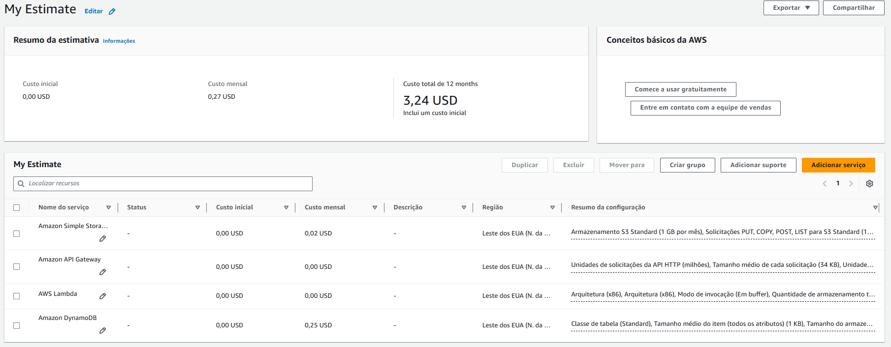

# 🚀 AWS Serverless: Contador de Acessos

  
  
  
  
  
  
  
  
  

## 1. Visão Geral do Projeto
Uma startup de marketing demandou a criação de uma página de "Em Breve" para o lançamento de um novo produto. O requisito central era a implementação de um contador de acessos simples e público. Devido à imprevisibilidade do tráfego (podendo variar de dezenas a milhões de acessos), a solução precisava ser estritamente **Serverless**, garantindo alta disponibilidade, escalabilidade automática e custos atrelados exclusivamente ao uso real.

## 2. Arquitetura da Solução
A arquitetura foi desenhada utilizando serviços nativos da Amazon Web Services (AWS), dividida em camadas de armazenamento de dados, processamento lógico, roteamento de API e hospedagem de interface estática.

* **Front-End:** Amazon S3 (Static Website Hosting)
* **Roteamento (API):** Amazon API Gateway (REST API)
* **Computação (Lógica):** AWS Lambda (Node.js)
* **Banco de Dados:** Amazon DynamoDB (NoSQL)

### Diagrama da Arquitetura

## 3. Implementação do Back-End (Infraestrutura)

### 3.1. Banco de Dados (Amazon DynamoDB)
Foi criada uma tabela focada em alta performance de leitura e gravação:
* **Nome da Tabela:** `TabelaContador`
* **Partition Key:** `id` (String). Para este caso de uso simples, optou-se por utilizar uma chave fixa com o valor `hits`.
* **Capacity Mode:** *On-demand* (sob demanda). Esta escolha arquitetural foi feita para garantir que os custos operacionais fossem de apenas frações de centavos por requisição, eliminando o custo de capacidade ociosa.

### 3.2. Função de Computação (AWS Lambda)
A lógica de incremento do contador foi centralizada em uma função Lambda utilizando Node.js.

* **Desafio Técnico de Segurança (IAM):** A função foi atrelada à `LabRole` existente para garantir a comunicação segura com o DynamoDB.
* **Otimização de Custos e Integridade (Cache em Memória):** Para evitar que usuários inflassem o contador artificialmente ao atualizar a página várias vezes (F5), foi implementado um mecanismo de cache na memória RAM do container do Lambda utilizando um objeto `Set()`. O código captura o IP do visitante via API Gateway e bloqueia gravações redundantes no DynamoDB durante o tempo de vida do container (*Warm Start*), retornando apenas o valor de leitura.

### 3.3. Roteamento e Proteção (Amazon API Gateway)

A função Lambda foi exposta para a internet pública através de uma API REST.

* **Integração:** Foi ativado o recurso *Lambda Proxy Integration*, permitindo que os cabeçalhos HTTP (como regras de CORS) definidos no código do Lambda fossem repassados corretamente ao navegador do cliente, evitando bloqueios de Cross-Origin.
* **Segurança (Throttling):** Para mitigar abusos, ataques de repetição ou ações de bots, foi configurado o *Rate Limiting* direto no estágio (`prod`) do API Gateway, estabelecendo um teto seguro para requisições por segundo, protegendo o banco de dados e controlando custos.

## 4. Implementação do Front-End

A interface foi construída com HTML, CSS e JavaScript puros, focando em performance e responsividade (Mobile First).

* **Estratégia de Otimização de Experiência (UX):** Para evitar que o usuário perceba a latência da comunicação com a API em conexões lentas, foi implementada uma estratégia de cache local utilizando o `localStorage` do navegador. O número de acessos salvo na última visita é exibido instantaneamente, enquanto o JavaScript faz o *fetch* assíncrono (em background) para atualizar o valor real na tela em seguida.
* **Hospedagem:** Os arquivos estáticos foram hospedados em um Bucket do Amazon S3, com a funcionalidade *Static Website Hosting* habilitada e as políticas de balde (Bucket Policy) ajustadas para permitir a leitura pública dos objetos.

## 5. Estimativa de Custos e Viabilidade Comercial

Para validar a eficiência financeira da arquitetura proposta, foi gerada uma estimativa de custos projetando um cenário de alto tráfego com **100.000 acessos mensais**, provisionando os serviços base e camadas adicionais de segurança (AWS WAF) e observabilidade (CloudWatch Logs). O custo provisionado atesta a altíssima eficiência da computação sob demanda.

*(Veja o relatório completo em PDF na pasta `/docs/estimativa-custos.pdf` ([estimativa-custos.pdf](docs/estimativa-custos.pdf))*

## 6. Evidências do Projeto em Produção

A infraestrutura encontra-se operando em nuvem e pode ser validada através dos seguintes endpoints:

* **Interface Gráfica (S3):** [https://meu-contador-em-breve-2026.s3.us-east-1.amazonaws.com/index.html](https://meu-contador-em-breve-2026.s3.us-east-1.amazonaws.com/index.html)
* **Endpoint da API REST:** `https://ay7ecr9u15.execute-api.us-east-1.amazonaws.com/prod/contador`

## 7. Práticas de DevOps e Infraestrutura como Código (IaC)

Visando a automação e esteira de entrega contínua, o repositório conta com:

* `deploy.sh`: Script Shell para sincronização automatizada dos ativos estáticos no Amazon S3 via AWS CLI.
* `template.yml`: Documentação da infraestrutura em formato AWS SAM/CloudFormation, servindo de base para o provisionamento via IaC.

## 8. Conclusões

O projeto demonstrou com sucesso a viabilidade da utilização de arquiteturas completamente gerenciadas (Serverless). A resolução de problemas em tempo real — desde o contorno de restrições de infraestrutura como código (IaC) em laboratórios restritos até o tratamento de integração de CORS, proteção de banco de dados no back-end e performance no client-side — evidenciou a robustez da stack tecnológica escolhida e as melhores práticas do desenvolvimento e implantação de software em nuvem.
